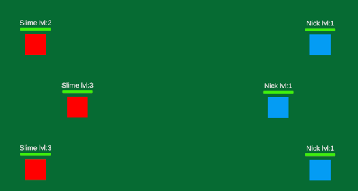

# RPG Turn-Based Prototype (Unity)

Ce projet est un prototype de base pour un **RPG au tour par tour avec mécaniques de QTE (Quick Time Events)**, développé sous Unity.

Ce projet a été conçu dans un but purement éducatif pour explorer le fonctionnement du moteur Unity, la gestion des états de jeu et la logique des combats.

## 📷 Aperçu

## 🛠️ Objectifs d'apprentissage
L'idée derrière ce projet était de manipuler les concepts suivants :
* **Gestion des combats au tour par tour :** Création d'une boucle de jeu simple (joueur vs IA).
* **Système de QTE :** Implémentation d'une mécanique de réaction en temps réel pendant les tours.
* **Architecture Unity :** Utilisation des `ScriptableObjects`, des interactions entre `GameObjects` et de l'interface utilisateur (UI).

## 🎮 État du projet
**Note :** Ce projet est un "work-in-progress" qui a atteint ses limites pédagogiques. Il n'est actuellement pas destiné à être transformé en jeu complet. Le code et les systèmes présents sont basiques et servent de "brouillon" technique pour tester mes connaissances.

## 🚀 Ce que j'en retire
Même si le projet s'arrête ici, cette expérience m'a permis de mieux comprendre :
* Comment structurer une scène sous Unity.
* Comment gérer des interactions simples entre entités via des scripts C#.
* Les défis liés à la synchronisation des événements dans un jeu au tour par tour.
